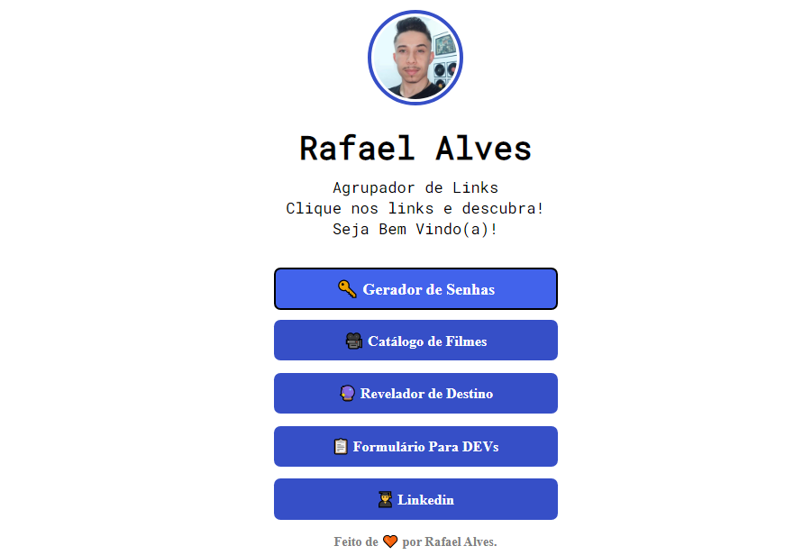

<h1 align="center">Agrupador de Links</h1>

Projeto webpage desenvolvido para praticar as ferramentas de front-end.

---

<h1 align="center">
  
</h1>

---
 
### 🛠 Tecnologias:

As seguintes ferramentas foram usadas na construção do projeto:

---

<h2>👩🏽‍💻 Autor:</h2>
 

<h3>Rafael Alves</h3>

Projeto realizado por Rafael Alves Teixeira

